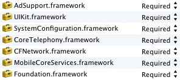
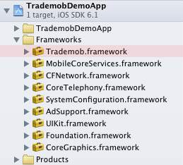

<p align="center"></p>

---

## Integrating the framework

#### 1. Clone the project:

	$ git clone https://github.com/trademob/TrademobFrameworkiOS.git

After cloning the repository a folder called "TrademobFramework" has been created.

#### 2. Add the SDK to your project

###### Framework depenencies

Add the following frameworks to your project.



###### Trademob framework

Open the TrademobFramework/Framework folder and drag the Tradmob.framework folder to an appropriate group in your project. In the example below it was just added on top of all other frameworks the project uses.



#### 3. Add tracking code

###### File: Prefix.pch

Add the TMTracker header to your prefix file. For a freshly setup project you prefix file should look similar to the example:

```
#ifdef __OBJC__
  #import <UIKit/UIKit.h>
  #import <Foundation/Foundation.h>
  #import <Trademob/TMTracker.h>
#endif
```

###### File: AppDelegate

* Add <code>[TMTracker start]</code> to the <code>-(BOOL)application:didFinishLaunchingWithOptions</code> method
* Add <code>[TMTracker setOpenURL:url]</code> to the <code>- (BOOL)application:(UIApplication *)application openURL:(NSURL *)url sourceApplication:(NSString *)sourceApplication annotation:(id)annotation</code> method
* Configure tracking options if desired
* You are ready to go

If you add the Trademob.framework to a freshly setup project your AppDelegate should look like this:


```
// TrademobSDK
#import "TMTracker.h"

@implementation AppDelegate

- (BOOL)application:(UIApplication *)application
  didFinishLaunchingWithOptions:(NSDictionary *)launchOptions
{  
  // Start Tracking
  [TMTracker start];
  
  // Display window
  [self.window makeKeyAndVisible];
  
  // Application launch finished  
  return YES;
}

- (BOOL)application:(UIApplication *)application
            openURL:(NSURL *)url
  sourceApplication:(NSString *)sourceApplication
         annotation:(id)annotation
{
  // Store open URL
  [TMTracker setOpenURL:url];
  return YES;
}

@end

```

#### 4. Options

Certain tracking features can be disabled via feature mask. See the list below for possible options.

Flag                               | Description
-----------------------------------|--------------------------------------------------
TMTrackingFeatureMaskNone          | enables all features (this is the default value)
TMTrackingFeatureMaskMAC           | disables  MAC Adress tracking
TMTrackingFeatureMaskWifiSSID      | disables WIFISSID tracking
TMTrackingFeatureMaskCarrier       | disables phone carrier tracking

Values can be combined using bitwise inclusive OR.
Example: To disable all features mentioned above combine the values like so:

```
// Create tracking feature mask
TMTrackingFeatureMask mask;
mask = (TMTrackingFeatureMaskMAC|
        TMTrackingFeatureMaskWifiSSID|
        TMTrackingFeatureMaskCarrier);

// Set mask
[TMTracker setTrackingFeatureMask:mask];
```

#### 5. Custom tracking

Tracking happens completely automatic but if desired special events can be tracked by the developer using custom tracking events. A custom tracking event is beeing composed of an event key and an optional info value.

```
// Generate an action info hash that contains any domain-specific key-value pairs
// and an integer typed value
NSDictionary *info = @{
  @"user_id": @"anywho",
  @"stuff_id": @"anywhat",
  @"value": @1299
};

// Call the Trademob Tracker singleton to track the action and its info hash
[TMTracker track:@"foobar_action" info:info];
```

#### 6. Click context

See below for a sample of how to fetch campaign information belonging to the banner the app was installed from. When starting the app for the first time campaign information is only available after a short delay. This methods initiates several successive remote querys in order to get the data as fast as possible. Nevertheless please note that it can take up to 250 seconds before the callback block will be invoked with the fetch result.
 
 ```
  [TMTracker clickContextCompletionHandler: ^(NSDictionary *context, NSError *error){

	// Fetch failed: Cancel
    if (error) return;
    
    // Fetch succeeded: Do something with the data ...
    if (context) NSLog(@"Payload found!");
  }];

 ```

#### 7. Demo app

The demo app features a simple project readily setup for Trademob tracking.

#### 8. Requirements

* Minimum iOS version: 5.1.1
* Framework size: 231kb
